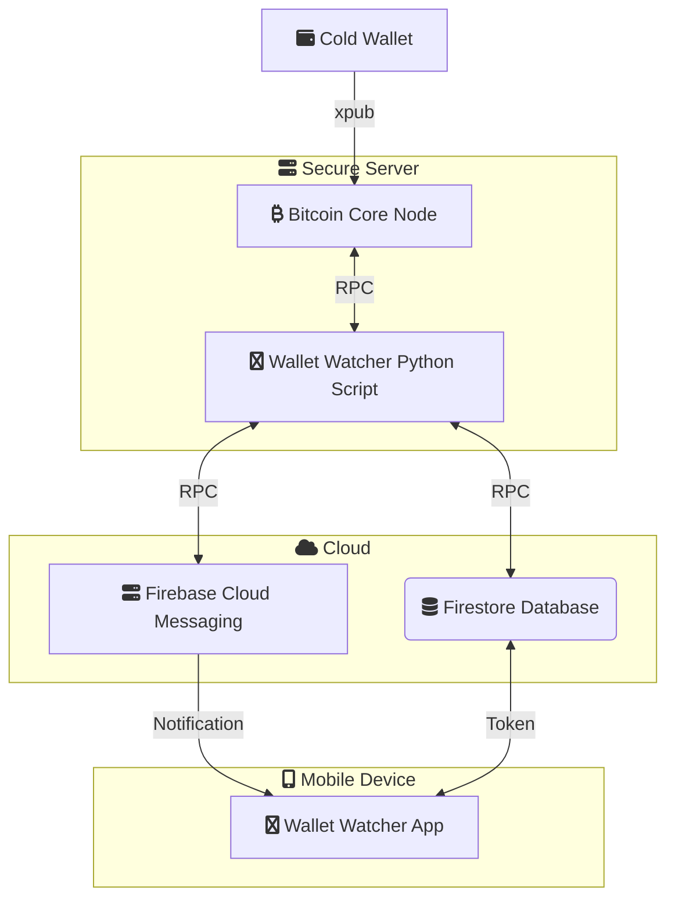

 

# Wallet Watcher

This project provides a secure method for monitoring the balance of a cold wallet without compromising its security. It utilises a Python script, running on a  Bitcoin Core node, to monitor a read-only wallet created from a cold wallet's xpub, and uses Firebase Cloud Messaging (FCM) to send notifications of balance changes to a mobile phone device.

## Overview

Wallet Watcher is divided into two main components:

1.  **Python Script (Server-Side):**
    * Runs on a personal, secure Bitcoin Core node.
    * Uses a cold wallet's extended public key (xpub) to create and monitor a read-only wallet on the Bitcoin Core node.
    * Periodically checks the balance of the created wallet using the Bitcoin Core node's `getbalance` RPC call.
    * Sends notifications to a mobile phone device on balance changes.
    * Sends a "heartbeat" notification every 24 hours to confirm the script is running.
    * Sends a notification if the script is shutdown.
    * See the [Python README](python/README.md) for detailed instructions.
2.  **Lightweight Android App (Client-Side):**
    * Receives notifications about balance changes and script status on a mobile phone device.
    * Its sole purpose is to receive and present notifications from the server-side Python script.
    * See the [Android README](android/README.md) for detailed instructions.

## Functionality

* **Cold Wallet Monitoring:** The Python script utilises a cold wallet's xpub to create a read-only wallet on the Bitcoin Core node, enabling balance monitoring without compromising the cold wallet's security.
* **Real-time Balance Monitoring:** The Python script continuously monitors the Bitcoin wallet's balance.
* **Change Notifications:** When a balance change is detected, a notification is sent to the mobile phone device.
* **Heartbeat Notifications:** A regular heartbeat notification confirms the script's operational status.
* **Shutdown Notifications:** A notification is sent if the script is stopped, ensuring awareness of monitoring interruptions.

## Security

* **Minimal Data Exposure:** Notifications on mobile device only indicate a balance change or script status, minimizing potential information leakage. Notifications indicate just that a balance change event has occured and do not contain the balance amount.
* **No Wallet Information on Mobile Phone Device:** The mobile phone device never stores any private keys, xpubs, or any other wallet information. If the device is lost or compromised, the wallet remains completely secure, and **even the wallet's existence and balance are unknown to the phone.**
* **Ephemeral Notifications:** Notifications are designed to be short-lived, minimizing the window of potential data exposure. They are intended for immediate alerts and do not persist on the mobile device.
* **No Wallet Information Shared with Third Parties:** The Python script and Bitcoin Core node run on a personal, secure server, ensuring that no wallet information (xpubs and balances) is shared with any third party.
* **Personal Server:** All wallet data is kept on a personal, secure server, preventing any third-party access to the sensitive information.
* **Cold Wallet Security:** The use of xpubs to create a read-only wallet on the Bitcoin Core node allows for balance monitoring without compromising the security of cold wallets. Because xpubs are used, the wallet is "read-only," and no funds can be moved.
* **Node Security:** The security of the Bitcoin Core node and the Python script's execution environment is paramount. Ensure the server is properly secured with firewalls, access controls, and up-to-date software.
* **RPC Authentication:** Strong RPC credentials are essential to prevent unauthorised access to the Bitcoin Core node.
* **Firebase Cloud Messaging Security:** FCM provides secure communication channels. Ensure your FCM project is configured with appropriate security measures.

## Connectivity Diagram

Here's a diagram illustrating the connectivity between the various components:

## Contributing

Contributions are welcome! Please feel free to submit a pull request.

## Licence

This project is licensed under the MIT Licence - see the [LICENCE](LICENSE) file for details.
